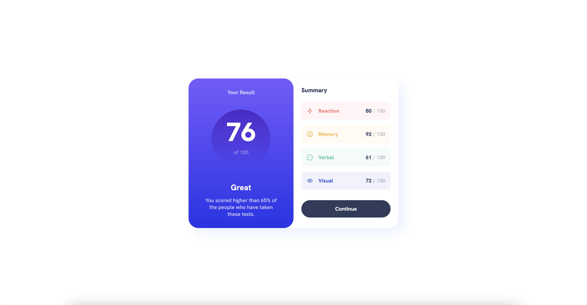

# Frontend Mentor - Results summary component solution

This is a solution to the [Results summary component challenge on Frontend Mentor](https://www.frontendmentor.io/challenges/results-summary-component-CE_K6s0maV). Frontend Mentor challenges help you improve your coding skills by building realistic projects.

## Table of contents

- [The challenge](#the-challenge)
- [Screenshot](#screenshot)
- [Links](#links)
- [Built with](#built-with)
- [Author](#author)

### The challenge

Users should be able to:

- View the optimal layout for the interface depending on their device's screen size
- See hover and focus states for all interactive elements on the page

### Screenshot

Add a screenshot of your solution. The easiest way to do this is to use Chrome to view your project.

### Links

- Solution URL: [https://github.com/kevinjpuscan/result-summary-component](https://github.com/kevinjpuscan/result-summary-component)
- Live Site URL: [https://kevinjpuscan.github.io/result-summary-component/](https://kevinjpuscan.github.io/result-summary-component/)

### Built with

- Semantic HTML5 markup
- CSS custom properties
- Flexbox
- CSS Grid
- Mobile-first workflow

### Author

- Website - [Kevin Puscan](https://www.kevinpuscan.com)
- Frontend Mentor - [@kevinjpuscan](https://www.frontendmentor.io/profile/kevinjpuscan)
- Twitter - [@kevinpuscan](https://twitter.com/KevinPuscan)
